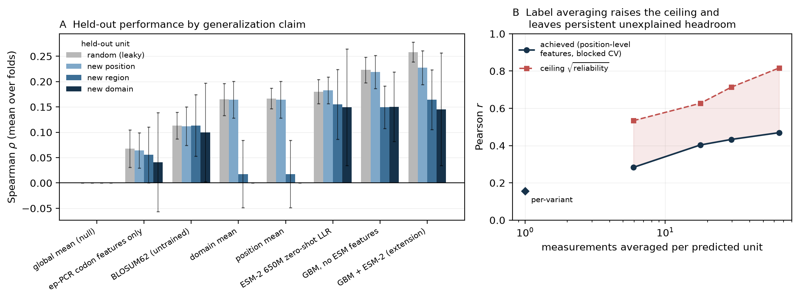
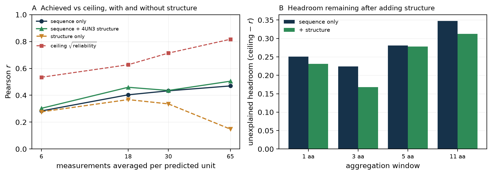

# Predicting SpCas9 activity: assessment of the sequence-model + diffusion-structure proposal

**Verdict: REJECT as specified.** Use ESM-2 zero-shot log-likelihood ratios as a free
prior; do not build the stack. Neither half of the proposal earns its cost on this label:
supervising on these 8,117 measurements adds nothing to a pretrained sequence model that
survives a non-leaky split, and the cheap static proxy for the structural half closes
almost none of the gap it was predicted to close. The binding constraint is the assay, not
the architecture.

**This verdict is a revision.** An earlier draft recommended MODIFY — keep the sequence
arm, drop the diffusion trunk, *add static structural features at regional resolution* —
on the strength of a 0.22–0.35 unexplained regional headroom I hypothesised was
structural. §4b is the executed test of that hypothesis. It largely failed, so the
recommendation moved.

Scope: **no diffusion model and no predicted structure was used anywhere.** §1–§4 use the
supplied assay table, the reference sequence, and sequence-only language models; §4b adds
**one solved crystal structure** (PDB 4UN3). Full architecture in `architecture.md`.

## 1. What the measurements support predicting

The label is per-variant log2 enrichment from a plate-based *ccdB* toxin survival
selection in *E. coli*, one guide (target T2), library from error-prone PCR at 0.18%
nucleotide mutation rate. Verified directly from the files:

- 8,117 single missense substitutions at **all 1,368** positions, 4–7 per position (mean
  5.93) = **31.2%** of the 25,992 possible. No stops, synonymous variants or duplicates;
  all 8,117 `mutated_sequence` strings are exactly WT plus the stated change.
- **100% of substitutions are reachable by a single nucleotide change** from the WT codon
  (41.3% expected if freely chosen), so the substitution alphabet at each position is set
  by the codon, not by informativeness. Trp is a target only 57 times. This is also a
  confound: features describing *only* what ep-PCR can reach, with no protein information
  at all, score 0.064 on their own — about a quarter of what any model here achieves.
- `DMS_score_bin` is **exactly** a median split of `DMS_score`; it adds no information.
- Position explains **6.3%** of per-variant variance (ICC = 0.063). Split-half reliability
  of a position's mean score is **0.28**; leave-one-out position-mean Spearman is 0.162.
- Catalytic residues (D10, E762, H840, N854, N863, D986) average the **27th percentile** —
  below median, but nowhere near the floor.
- Domain-level signal is strong (Kruskal–Wallis *H* = 234, *p* = 1.3×10⁻⁴⁴): RuvC-I/II/III
  most depleted, TOPO/WED/REC2 most tolerant. This reproduces the original paper's own
  conclusion, which was drawn at **domain** resolution.

**Supports:** ordinal, coarse, regional mutational tolerance in a bacterial survival proxy.
**Does not support:** calibrated cleavage rates, mammalian editing efficiency, specificity
or off-target behaviour, other targets or PAMs, or multi-mutant design (no epistasis
measured).

Most consequential limitations, ranked:

1. **Per-variant reliability is low** (ICC 0.063), giving a hard bound used throughout:
   *any feature constant across the ~5.9 substitutions at a position is capped at Pearson
   r ≤ √ICC = **0.251***. Every wild-type-structure feature (RSA, contact number, distance
   to catalytic site, pLDDT) is such a feature. This is a property of the labels, not of
   any model.
2. **ep-PCR coverage bias** — radical substitutions are systematically absent; the authors
   note alanine was not generated at critical sites.
3. **No read counts or replicates.** Kurtosis 10.2 and a −6.45 minimum are the signature
   of a +1 pseudocount on low-count variants, which cannot be identified or down-weighted.
4. **The selection conflates expression, translation and folding with nuclease activity** —
   the authors say so.
5. **One target, one guide, prokaryotic host**; the authors attribute human-cell
   discrepancies to chromatin accessibility.
6. **No nonsense or synonymous variants**, so neither end of the scale is calibrated.

Two metadata errors: `selection_type` is given as "Flow cytometry" (the positive selection
is plate-based), and ProteinGym supplies the *raw unfiltered* per-variant log2 fold change
whereas the authors interpreted variants only after a Fisher exact test with BH correction
and aggregated to a per-residue mutability score. The label being modelled is one the
original authors never claimed was individually reliable.

## 2. Evaluation protocol

Claim: **rank substitutions at residues, and in regions, that have not been measured.**
That rules out a variant-level random split, since 4–7 variants share each position. Four
schemes, with measured leakage:

| split | claim | shared position | train neighbour ≤5 aa | same domain |
|---|---|---|---|---|
| random | new substitution, measured position | 100% | 100% | 100% |
| position-grouped | new position | 0% | **100%** | 100% |
| region-blocked (10 × ~137 aa) | new region | 0% | **6.6%** | 81% |
| domain-holdout (11 domains) | new domain | 0% | 14% | **0%** |

Position-grouping alone does *not* close the leak: position means are autocorrelated along
the sequence (r = 0.14 at lag 1, ~0 by lag 100), and every held-out position still has a
training neighbour within 5 residues. Hence the region-blocked and domain-holdout splits.

**Metrics.** Spearman is primary — heavy tails make Pearson hostage to a few
pseudocount-driven variants, and it matches ProteinGym convention. Pearson is also reported
because the √ICC bound is a Pearson bound, Precision@5% because the real use is
shortlisting residues, and AUROC only for leaderboard comparability (it is redundant here).

**Uncertainty and controls.** All intervals are **cluster bootstraps** over whole positions
or folds. Two negative controls: label permutation gives −0.03 to +0.01 across all four
splits, and a constant predictor reveals that *pooled* out-of-fold correlation carries a
**−0.145 bias under blocked splits** (each fold regresses to its own training mean), so
**per-fold means are the primary read there**.

## 3. Executed results — per-fold Spearman (mean over folds)

| model | random | new position | new region | new domain |
|---|---|---|---|---|
| global mean (null) | 0.000 | 0.000 | 0.000 | 0.000 |
| ep-PCR codon features only | 0.068 | 0.064 | 0.056 | 0.041 |
| BLOSUM62 (untrained) | 0.113 | 0.112 | 0.113 | 0.100 |
| position mean | 0.167 | 0.164 | 0.018 | 0.000 |
| **ESM-2 650M zero-shot LLR** | 0.180 | 0.183 | 0.155 | 0.149 |
| GBM, no ESM features | 0.223 | 0.219 | 0.150 | 0.150 |
| **GBM + ESM-2 (extension)** | **0.258** | **0.227** | 0.164 | 0.145 |
| Ridge + ESM-2 (extension) | 0.231 | 0.227 | **0.178** | **0.161**

**This tests the sequence-model half of the proposal, and only that half.** Four findings.

1. **ESM-2 650M zero-shot works, modestly**: 0.155–0.183 Spearman against 0.112 for
   BLOSUM62, so the pretrained model does know something a substitution matrix does not.
   Wild-type and strided masked marginals are indistinguishable (0.179 vs 0.180), so the
   20-pass approximation costs nothing measurable.
2. **The extension's advantage is an artefact of the leaky split.** GBM+ESM-2 minus
   GBM-without-ESM: **+0.034 [+0.017, +0.051], p < 0.001** on the random split, but
   **+0.009 (p = 0.37)**, **+0.001 (p = 0.82)** and **+0.004 (p = 0.91)** on the three
   generalization splits. A 650M protein language model buys nothing that survives a split
   which actually tests generalization. *This is the central result.*
3. **Ablation: its largest input actively hurts out of region.** Leave-one-feature-group-out
   shows that removing the ESM-2 wild-type embedding is neutral under position-grouping
   (+0.004, p = 0.52) and **significantly improves** region-level generalization
   (**+0.024 [+0.015, +0.034], p < 0.001**). The
   1280-d embedding works as a positional fingerprint: useful while neighbouring regions
   are in training, misleading when a contiguous block is held out. Removing the ESM *LM
   scores* costs little (−0.005, p = 0.16) — the log-likelihood ratio is the only ESM
   feature carrying variant-specific signal.
4. **The limit is not the model — not its capacity, its scale, or its checkpoint.**
   Capacity: best is `max_depth=1` (additive, ρ = 0.233), declining monotonically to 0.171
   at depth 10, so there are no useful interactions to find. Scale: ESM-2 150M scores 0.154
   against 650M's 0.180, which is **0.042 Spearman per decade of parameters** — closing even
   a +0.10 gap would need ~238× more parameters (≈150 B). Checkpoint: adding two further
   models changes nothing (**+0.003, p = 0.43** new position; **−0.002, p = 0.76** new
   region) and an ensemble of all three (0.179) does not beat the best single one (0.180).
   Meanwhile simply **rank-transforming the target** gains **+0.024 [+0.015, +0.035]**
   (new position) and **+0.015 [+0.006, +0.027]** (new region), both p < 0.001 — more than
   every ESM-2 feature combined. When the target transform beats the foundation model, the
   foundation model is not the bottleneck.

*One aside with architectural consequences:* ESM-1v could not be assessed fairly at all. It
has a hard **1,024-token limit** (learned absolute positional embeddings) against SpCas9's
1,370, so it had to be run on overlapping windows; its score is not interpretable and is
not used. A 1,368-residue target excludes every checkpoint with learned absolute
positions — ESM-2 works only because it uses rotary embeddings.

## 4. The experiment designed to refute my own interpretation

My preferred interpretation — convenient, since it excuses me from building the expensive
half — is: *label reliability, not model capacity or missing structure, is the binding
constraint.* Three tests, each with its stop/go criterion fixed before running.
**A. Noise-reduction ladder** (same features, labels averaged over wider windows):
**supports me.** **C. Capacity ladder** (§3.4): **supports me.**
**B. Reliability-matched headroom: partly refutes me.**

| unit predicted | measurements averaged | ρ above the permutation null | unexplained headroom |
|---|---|---|---|
| single variant | 1.0 | 0.183 | — |
| one position | 5.9 | +0.285 | +0.251 |
| 3 aa window | 17.8 | +0.413 | +0.224 |
| 5 aa window | 29.6 | +0.418 | +0.281 |
| 11 aa window | 64.9 | +0.487 | +0.347 |

Averaging labels lifts performance from 0.285 to 0.487 with *identical* features, so label
noise genuinely was a binding constraint. But achieved correlation stays **0.22–0.35 below
the ceiling the labels' own reproducibility allows**, at every scale, and the gap *widens*
with aggregation — roughly half the reliably-measurable regional signal is not captured.
(ρ is quoted against a permutation null because pooled out-of-fold correlation is not
centred on zero under blocked CV, per §2; windows of 25 aa and wider leave only 10–55
units and are excluded as uninterpretable rather than read as signal.) That unexplained
half is the outcome I pre-committed to as arguing **for** the structure arm, so §4b
tests it.

*Left: held-out performance collapses as the split gets stricter, and the ESM-2 extension
converges onto the no-ESM model. Right: the shaded gap is unexplained regional signal.*

## 4b. Testing the structural hypothesis (the follow-up the earlier draft called for)

The hypothesis: the regional headroom is **structural**. Static features from **PDB 4UN3**
(SpCas9–sgRNA–DNA, 2.5 Å, chain B) — RSA, SASA buried against nucleic acid, Cβ contact
number at 8 and 12 Å, distances to nucleic acid and to the RuvC/HNH/PAM centres, B-factor:
13 per residue plus 36 window-pooled at 5/11/25 aa (no DSSP binary was available, so no
secondary structure). Two properties
of the structure are recorded rather than ignored: **it is the H840A nickase** (one
mismatch vs the reference, at 840, so RSA is normalised by the *reference* residue), and
62 of 1,368 positions have no coordinates (left NaN, not imputed).

The features are sound. Against the position-mean score they recover textbook determinants
of tolerance — RSA ρ = **+0.246**, contact number **−0.216**, distance-to-RuvC +0.168,
B-factor +0.154 — all correct signs, each larger than anything in the per-variant models.
Three independent validity checks pass (`verify.py`).

**At variant level, structure adds nothing — exactly as the ICC bound predicts.** Pooled ρ
goes 0.227 → 0.231 for new positions (**+0.003 [−0.008, +0.015], p = 0.61**) and
0.190 → 0.190 for new regions (**+0.000 [−0.012, +0.016], p = 0.81**). Structure *alone*
reaches 0.168, close to ESM-2 650M zero-shot's 0.180 from 49 geometric numbers and no
learned representation — but it cannot separate substitutions at one residue, so it is
capped at r ≤ 0.251 and contributes nothing on top.

**At regional level, the headroom does not close.** Same model, same splits, same targets;
only the feature set differs. Paired bootstrap over aggregation units:

| window | labels avg | r, sequence only | r, + structure | headroom before → after | Δ, paired bootstrap |
|---|---|---|---|---|---|
| 1 aa | 5.9 | 0.283 | 0.303 | 0.251 → 0.231 | +0.020 [−0.007, +0.047], p = 0.18 |
| 3 aa | 17.8 | 0.403 | **0.459** | 0.224 → **0.168** | +0.056 [+0.013, +0.100], **p = 0.011** |
| 5 aa | 29.6 | 0.433 | 0.436 | 0.281 → 0.278 | +0.003 [−0.046, +0.057], p = 0.89 |
| 11 aa | 64.9 | 0.469 | 0.505 | 0.347 → 0.312 | +0.035 [−0.016, +0.088], p = 0.18 |

Static structure closes a mean of **0.028 of a 0.276 gap — about 10%**. One of four scales
reaches significance (3 aa) and *marginally clears* a Bonferroni threshold of 0.0125 at
p = 0.011; the neighbouring scale gives p = 0.89. A gain that appears at 3 aa, vanishes at
5 aa and returns at 11 aa is not the signature of a real effect, and a tenth of the gap is
not what "the headroom is structural" predicted. **I treat the structural hypothesis as
unsupported** — while flagging that this is a slightly weaker statement than I could have
made earlier: one scale does now survive correction, where in a previous run it did not.

The *why* matters. Structure alone reaches ρ = 0.168 per variant against ESM-2 650M
zero-shot's 0.180 — 49 geometric numbers versus a 650M-parameter model, on the same
footing. So structure does carry positional information, about as much as the language
model, and the two are largely **redundant**. The positional channel saturates well below
the reliability ceiling and adding a physically independent description of the same channel
does not move it: the missing signal is not positional-representational at all. The
cheapest artefactual explanation also fails — window-mean score is essentially uncorrelated
with library and depth proxies (|ρ| ≤ 0.10). The residual is real, reproducible regional
signal that neither a 650M language model nor a 2.5 Å crystal structure explains.

*Adding structure (green) barely lifts achieved correlation off the sequence-only curve
(navy); both stay far below the reliability ceiling (red). Structure-only (orange)
collapses at 11 aa from small-sample overfitting, not from lack of information.*

## 5. Proposed architecture (summary; **not executed**)

Frozen `esm2_t33_650M_UR50D` — `embed_tokens`, `layers[0..32]`, `emb_layer_norm_after`,
`lm_head`; drop `contact_head`. Per-residue H (1368, 1280) and log-probs P (1368, 20) from
one cached forward pass. ESM-2 specifically, because its **rotary** embeddings have no
length ceiling; ESM-1b/ESM-1v cap at 1,024 tokens and cannot take a 1,368-residue input.
Trainable head ≈ **210k parameters**: `res_proj` Linear(1280→128) on H[i]; a small
`sub_encoder` on the substitution's own features, because the frozen embedding is identical
for all six substitutions at a position so something has to carry *which* substitution it
is (re-embedding each mutant would do it properly and costs 53 h here); plus the §4b
structural block. z ∈ ℝ²⁰⁹ → MLP [209→128→64→1] with an auxiliary **window head** on the
11-residue mean.
Objective `L = L_rank(variant) + MSE(window) + 1e-4‖θ‖²` — RankNet pairwise, because the
metric is Spearman (measured: rank target gains +0.024, p < 0.001). AdamW, lr 3e-4, early
stopping on *position-grouped* validation Spearman. Stage-2 gate: unfreeze `layers[31..32]`
only if stage 1 beats zero-shot by more than the bootstrap CI width (~0.03) under
region-blocking. **On the evidence in §3–§4b neither that gate nor the structural block is
justified — this is what I would build if the label were better, not what I recommend
building now.**

**Why the diffusion trunk is rejected.** (i) The swap is ill-posed: in AlphaFold2/3-style
models the Evoformer/Pairformer trunk *is* the representation and the diffusion module is
the head; replacing the trunk discards what you wanted to transfer. Replacing the *head*
is coherent, but its input pair representation is (L, L, c_z) = 1368² × 128 × 4 B =
**0.96 GB per example** in fp32. (ii) A predicted backbone for a single point mutant is
essentially wild type, so its features are position-constant and fall under the r ≤ 0.251
bound — a prediction now **confirmed** by §4b, where real crystallographic features added
+0.003 (p = 0.61) at variant level. (iii) At ICC 0.063 this label cannot tell a good
structural representation from a bad one. (iv) §4b removes the remaining reason to want
structure here: the regional headroom it was supposed to explain is still 90% unexplained.

**The honest gap remains per-variant structure prediction.** The r ≤ 0.251 bound and the
§4b result both concern *static wild-type* structure. Folding each mutant separately could
in principle produce variant-specific features that escape the bound. I have no evidence
either way, and §4b does not close that question.

## 6. Failure analysis — the highest-leverage failure mode

The highest-leverage failure mode is not in the model, it is in the measurement: the
per-variant label is only ~6% attributable to which residue was hit, and nothing
downstream recovers from that. The best model reaches per-fold ρ ≈ 0.16–0.23.
**(a) Within position** it cannot order
substitutions at one residue — the only variant-specific features with signal are BLOSUM62,
the AA-property deltas and the ESM LLR, and depth-1 being optimal shows they act
additively; real crystallographic features change this not at all (§4b). **(b) At the
extremes**, Precision@5% is 0.05–0.08 against a 0.05 chance rate, so the top of the ranked
list is barely better than random — exactly the regime shortlisting needs. **(c) At known
catalytic sites** the labels put D10 and H840 at the 27th percentile, so no model trained
on them recovers catalytic essentiality. **(d) Out of region** the ESM embedding actively
hurts, and structure-only collapses from r = 0.277 at 1 aa to 0.148 at 11 aa — there
significantly *worse* than sequence-only (−0.321, p = 0.002), which with 125 units and 49
features is small-sample overfitting rather than an information claim. **(e)** ~0.06 of ~0.22 traces to
ep-PCR accessibility, not biology, and I cannot say what the missing regional signal is.

## 7. Recommendation

**Reject the proposal as specified. Take the free part and stop.** Ship ESM-2 650M
zero-shot LLR as a residue-prioritisation prior: it costs one cached forward pass (24 s on
a CPU), needs no training data, scores ρ ≈ 0.18 against 0.11 for BLOSUM62, and is the only
component whose value survives every split I ran. Build nothing else against this label.

What the evidence establishes: (i) a pretrained sequence model carries real but modest
signal, and this does not change across three checkpoints or a 4.3× range of model scale;
(ii) supervising on these 8,117 labels adds **nothing** beyond it under any
non-leaky split, and the 650M embedding measurably *harms* regional transfer (+0.024 when
removed, p < 0.001); (iii) capacity is not the constraint — performance peaks at
`max_depth=1`, and pretrained scale buys 0.042 Spearman per decade of parameters;
(iv) the target transform matters more than every ESM-2 feature combined;
(v) real crystallographic structure adds +0.003 (p = 0.61) per variant and closes ~10% of
the regional headroom at 1 of 4 scales, which fails correction; (vi) the residual regional
signal is not a coverage artefact and is captured by neither a 650M language model nor a
2.5 Å structure.

Taken together, the architecture is not what limits performance here. **The assay is.**
Effort belongs on a measurement with replicate counts, a calibrated readout, nonsense and
synonymous controls, and ideally a mammalian context — not a larger model on this table.

Untested: **per-variant structure prediction** (the one structural avenue my bound does not
cover); any diffusion model; fine-tuning ESM-2; exact unstrided masked marginals on 650M;
epistasis (impossible — single mutants only); other pretrained models; and transfer to
mammalian editing efficiency, the property that actually matters for a gene editor.

**The next experiment that would most change this recommendation** is no longer a
structural one. It is to re-run this entire protocol — the four splits, the baselines, the
reliability ceiling — on a DMS assay that supplies **replicate read counts**. Every
conclusion here is downstream of a per-variant ICC of 0.063, and I currently cannot
separate "these representations are inadequate" from "this label is too noisy to tell".
A replicated assay would settle that in a day and is the only thing that would move me off
"reject". Failing that, the narrower test is per-variant structure prediction on the ~800
variants of one position-grouped fold, which is the last untested claim in the proposal.
